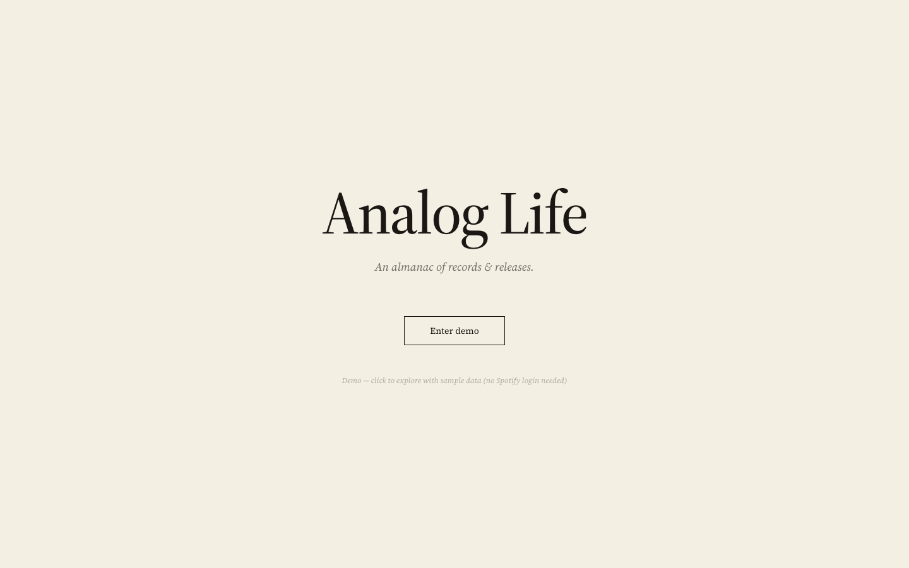
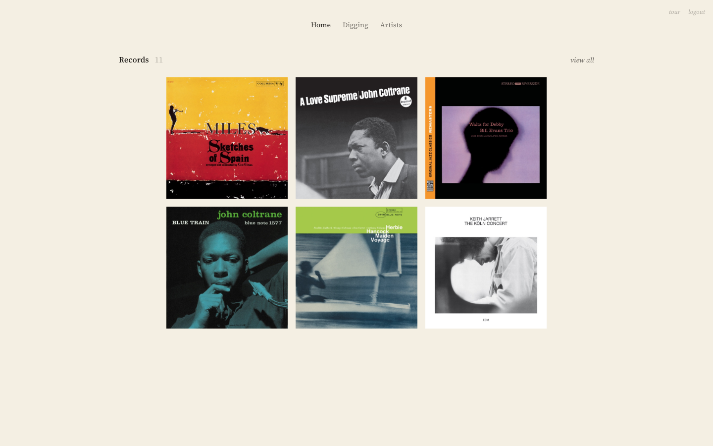
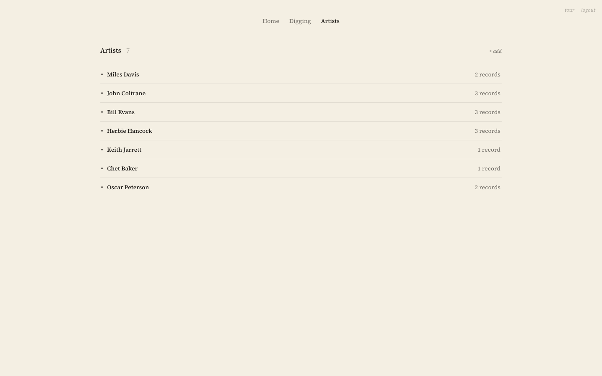
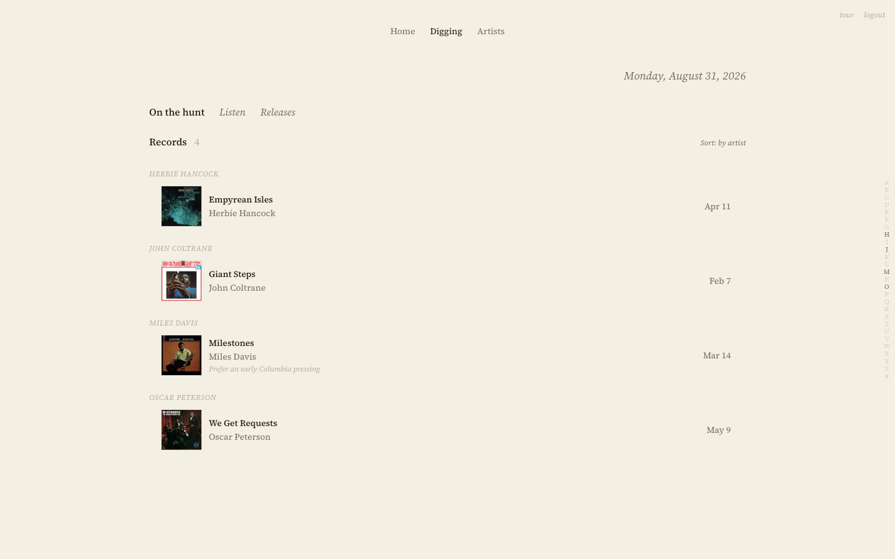
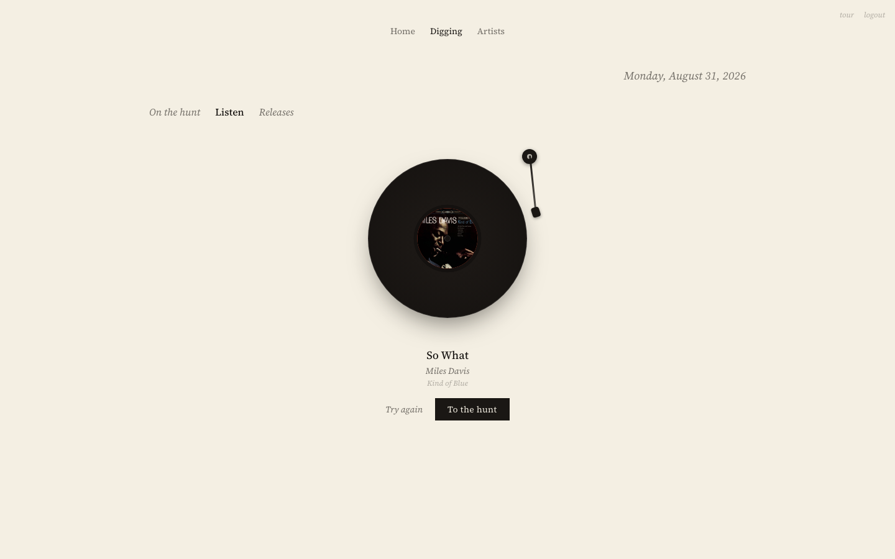
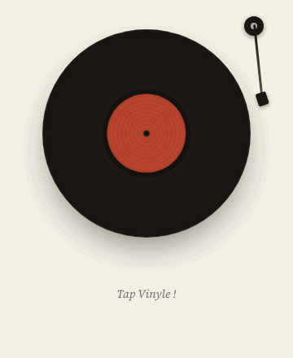
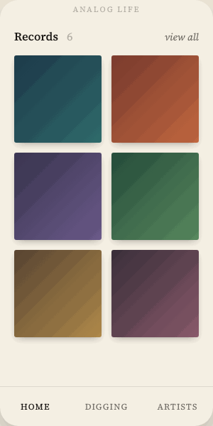

# jazz-life

> **Analog Life** — a personal dashboard for a jazz record collection. A visual shelf of the vinyl you own, a hunt list of the records you are looking for, new releases from the artists you follow via Spotify, and a "listen" mode that identifies the record playing in the shop and puts it on your list.

Built as a spec-first, ADR-driven full-stack project: **FastAPI + SQLModel + PostgreSQL** on the backend, **React 19 + TypeScript + TanStack Query** on the frontend, with the API contract generated from the backend's OpenAPI spec. The design record lives in [`docs/`](docs/README.md).

## Screenshots

All screenshots and GIFs are taken from the **demo mode** (sample data, no Spotify account). Album art is loaded from public CDN URLs.

| Login (Enter demo) | Home — the shelf |
|---|---|
|  |  |

| Artists | Digging — On the hunt |
|---|---|
|  |  |

| Listen — find a record by sound |
|---|
|  |

<p>
  
  &nbsp;&nbsp;
  
</p>

## Live demo — and why it is a demo

The hosted build runs in **mock mode** (`VITE_USE_MOCK=true`): an in-memory store seeded with sample records, so every screen works without a backend, a Spotify account or a microphone — including the Listen flow, which returns a sample recognition result. A short guided tour starts on first visit.

A public deployment with real Spotify login is **not possible by design**, not an omission: the app uses Spotify's Authorization Code flow, and Spotify apps in *Development Mode* can only authenticate up to 25 explicitly allow-listed accounts. *Extended Quota Mode*, which lifts that limit, is not granted to individual/hobby developers. The production instance therefore stays invite-only.

If you would like to try the real thing with your own Spotify account, open an issue and I will add you to the allow-list (it takes a minute), or run the full stack locally with your own Spotify app credentials — see [docs/DEVELOPMENT.md](docs/DEVELOPMENT.md).

## What it does

- **Home** — a curated shelf: up to six pinned records shown as a jacket grid; "view all" for the rest. Each record opens to its back cover: pressing, purchase date and store, favourite tracks, notes.
- **Digging** — everything you do not own yet, in three tabs: **On the hunt** (wanted records grouped A–Z by artist, or by date added), **Listen** (record ~12 s, identify the track, add the album to the hunt list) and **Releases** (new albums and singles from followed artists, with per-user read state and background sync from Spotify).
- **Artists** — the artists you follow, seeded automatically when you add a record and extendable via Spotify search.
- **Sign in with Spotify** — server-side OAuth; refresh tokens are encrypted at rest; the browser only ever holds a short-lived httpOnly session cookie.

## Architecture

```
┌──────────────────────────────┐          ┌───────────────────────────────────┐
│  React 19 + Vite + TS        │          │  FastAPI                          │
│  TanStack Query              │   HTTP   │  ┌─────────────────────────────┐  │
│  orval-generated hooks       │ ───────► │  │ routers  (HTTP only)        │  │
│  (VITE_USE_MOCK switches     │          │  │  └─ services (domain rules) │  │
│   between mock store and     │          │  │      └─ core/repositories   │  │
│   the real API)              │          │  └─────────────────────────────┘  │
└──────────────────────────────┘          │  SQLModel + Alembic               │
                                          └──────────┬────────────┬───────────┘
                                                     ▼            ▼
                                             PostgreSQL 16   Spotify Web API · AudD
```

| Layer | Stack |
|---|---|
| Backend | Python 3.11, FastAPI, SQLModel, Alembic, psycopg 3, pydantic-settings, httpx, PyJWT, uuid6 (UUID v7), cryptography (Fernet) |
| Frontend | React 19, Vite 5, TypeScript, Tailwind CSS v4, TanStack Query v5, React Router 6 |
| Contract | OpenAPI spec exported from the backend (`make spec`) → **orval** generates types + react-query hooks (`make gen`); both artifacts are committed and CI fails if they are stale |
| Data | PostgreSQL 16 (`jazz` + `jazz_test` databases in one instance) |
| Tooling | uv, npm, Docker Compose, dev container, GitHub Actions (ruff · mypy · pytest unit/integration · OpenAPI and client freshness) |
| Hosting | Railway (backend, nginx-served frontend, Postgres); Vercel for the mock demo (`app/frontend/vercel.json`) |

## Technical highlights

1. **Three-layer backend with one-way dependencies.** `routers → services → core/repositories`. Routers only translate HTTP; all domain rules (id assignment, partial updates, pin limits, auto-follow) live in services and raise `DomainError`s that a single `_handlers.py` maps to HTTP status codes. Decision record: [ADR-002 §2.2](docs/002-phase-b-decisions.md).
2. **Contract-driven frontend.** The backend owns `openapi.json`; the frontend never hand-writes API types. `src/api/client.ts` is the only place that knows whether it is talking to the real API or the in-memory mock, and the mock reproduces backend rules (lenient PUT, pin limit → 409, auto-pin, sort order) so the demo behaves like production.
3. **Multi-user data model done properly.** Records are split into a shared, de-duplicated *catalog* and per-user *ownership* rows ([ADR-006](docs/006-records-user-scope-schema.md)); releases follow the same pattern with per-user read state ([ADR-007](docs/007-releases-user-scope.md)). The API surface did not change during either migration.
4. **Spotify OAuth handled server-side.** Authorization Code flow, refresh tokens encrypted with a Fernet key before they touch Postgres, access tokens kept in memory, a short-lived JWT in an httpOnly cookie. Known trade-off: OAuth state is process-local, so the backend runs as a single replica — written down in [ADR-005 §2.10](docs/005-railway-deploy-prep.md) rather than discovered in production.
5. **Audio recognition as a thin, replaceable service.** Browser `MediaRecorder` → `POST /api/recognize` → AudD → normalized `RecognitionResult` → prefilled add-record form ([ADR-016](docs/016-audio-recognition-on-the-hunt.md)). A missing API token degrades to a 503, not a crash.
6. **Environment-driven deployment.** The same code runs locally, in a dev container and on Railway; only env vars differ ([ADR-005](docs/005-railway-deploy-prep.md)). Includes the small things that bite in production: `postgres://` URL normalization, an nginx reverse proxy that re-resolves the backend per request, a dual-stack (IPv4/IPv6) launcher.
7. **Decisions are recorded, including the wrong ones.** Fourteen documents in `docs/` trace the path from SQLite to PostgreSQL, from `openapi-typescript` to orval, from a single-user schema to user-scoped tables, and from "Feed" to "Digging". Each later ADR names what it supersedes. Index with English summaries: [docs/README.md](docs/README.md).

## Project status

| Phase | State | Scope |
|---|---|---|
| A — frontend mock | done | hand-written types, mock JSON, layout, record grid |
| B-1 — backend core | done | records + artists CRUD, PostgreSQL, 3-layer architecture, Alembic |
| B-2 — contract wiring | done | orval-generated client, real API for Home / Artists / Records |
| B-3 — features | mostly done | Spotify OAuth, album search, follow/unfollow, background release sync with status polling, read state, pins + auto-pin, hunt list, audio recognition, welcome toast, demo mode + tour. Not started: jacket upload, daily picks ([ADR-012](docs/012-daily-picks.md)) |
| Concerts | removed from the UI | models kept for a possible return ([ADR-013](docs/013-digging-tab-and-concert-removal.md)) |
| Hosting | proposed | move from Railway to free tiers, keeping audio recognition as the only paid decision ([ADR-018](docs/018-cost-minimization-service-distribution.md)) |

## How it was built (AI-assisted)

This project was developed spec-first with an AI coding assistant (Claude Code). I wrote the requirements and the ADRs, decided the architecture, the schema and the trade-offs, and reviewed every change; a large share of the implementation and test code was generated from those specifications and then iterated on. The ADRs in [`docs/`](docs/README.md) are the record of what was decided and why — that is the part of the repository I would point a reviewer to first. The agent-facing side of that workflow is kept in the repository too: [`CLAUDE.md`](CLAUDE.md) is the session brief (rules, verification checklist, where to read first) and [`.claude/skills/pr-summary/`](.claude/skills/pr-summary/SKILL.md) drafts PR descriptions from the diff.

## Getting started

Demo mode only (no backend, no credentials):

```bash
cd app/frontend
npm ci
VITE_USE_MOCK=true npm run dev      # http://localhost:5173 → "Enter demo"
```

Full stack (Docker):

```bash
cp app/.env.example app/.env        # fill in Spotify client id/secret, JWT_SECRET, REFRESH_TOKEN_KEY
cd app && make up                   # Postgres + backend (http://127.0.0.1:8000) + frontend (http://127.0.0.1:5173)
```

Open the app via `127.0.0.1`, not `localhost`: Spotify no longer accepts `localhost` redirect URIs, and the session cookie host must match. Setup paths (dev container / Codespaces / plain Docker), the command cheat sheet, the `make spec && make gen` rule, tests and deployment notes are in **[docs/DEVELOPMENT.md](docs/DEVELOPMENT.md)**.

Quick checks:

```bash
cd app/backend && uv sync && uv run ruff format --check . && uv run ruff check . && uv run mypy app && uv run pytest tests/unit
cd app/frontend && npm ci && npm run typecheck && npm run gen && git status --porcelain src/api/generated   # must be clean
```

## Repository layout

```
app/
  backend/      FastAPI app (app/routers · services · core/repositories · models · schemas), Alembic migrations, openapi.json
  frontend/     React app (src/api/client.ts mock/real switch, src/api/generated orval output, src/api/mocks demo fixtures)
  docker-compose.yml (+ .override.yml for dev), Makefile, .env.example
docs/           requirements, ADRs, DEVELOPMENT.md, media/
.devcontainer/  dev container / Codespaces definition
.github/        CI workflows (backend, frontend)
```

## Documentation

- [docs/README.md](docs/README.md) — index of all design documents with an English summary of each. ADR-002 and ADR-006 are fully in English; the remaining documents are in Japanese with an English summary at the top.
- [docs/DEVELOPMENT.md](docs/DEVELOPMENT.md) — developer guide.

## License

[MIT](LICENSE)
